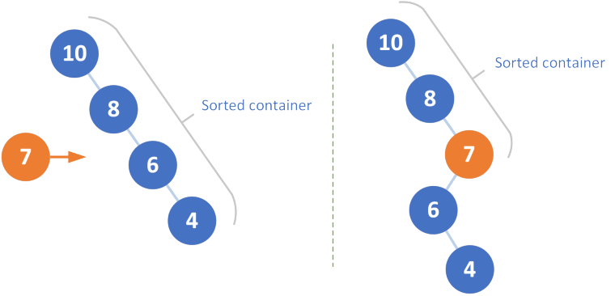

# 654. Maximum Binary Tree

最大值二叉树重构。

## Version 1

递归解法。每次以当前nums中最大值创建当前节点，递归重构左子树，右子树。

- 时间，最坏情况下，二叉树变为链表，算法复杂度$O(N^2)$，通常情况下，二叉树比较均衡我们期待高度为logn，因而算法复杂度为$O(N\cdot logN)$
- 空间，维护nums和树，$O(N)$  

````python
# version 1
# Runtime: 492 ms, faster than 5.70% of Python online submissions for Maximum Binary Tree.
# Memory Usage: 14 MB, less than 84.03% of Python online submissions for Maximum Binary Tree.
class Solution(object):
    def constructMaximumBinaryTree(self, nums):
        def rebuild(nums):
            if len(nums) > 0:
                # find max val and idx
                max_val = -1
                max_idx = -1
                for i,x in enumerate(nums):
                    max_val,max_idx = (x, i) if x > max_val else (max_val, max_idx)
                print(nums, max_val)
                return TreeNode(val = max_val, left = rebuild(nums[:max_idx]), right = rebuild(nums[max_idx+1:]))
        return rebuild(nums)
````

## Version 2

严格的$N\cdot log N$的解法。观察发现

1. 每次插入我们都不关心左子树——若插入大于当前节点cur，则cur称为插入节点的左子节点；否则，则成为cur的右子树中的节点。也就是，和左子树并无关系
2. 右子树寻找位置插入，其实可以视为 一种二分搜索，时间复杂度为$O(logN)$，则整体为$O(N\cdot logN)$ 
3. 二分搜索需要实现寻秩访问，由于节点非基本类型，所以这里需要空间换时间的解法。这里不给出实现，在c++中map插入会返回位置，map的底层原理是平衡树，所以可以实现该算法。 



## Version 3

一种严格的$O(N)$算法。

这是一种极为优雅的解法，本质上这类问题$O(N\cdot logN)$是一种天花板。在这个问题中，突破天花板的关键特点就是上述提到的，不需要管左子树的特性。以下算法使用栈，巧妙地实现了这个目标。

为了理解方便，你可以将该问题视为每次都从根节点向右子树插入。这看起来就很高效，实际上如果从根节点插入，最坏情况仍是会拉成一条链——不断插入更小的值，每次插入为$O(N)$，整体算法效率$O(N^2)$。当反过来从右子树最末尾的节点倒序插入，则可以在$O(1)$解决。考虑，如果是最小值，则直接成为末尾节点，如果非最小值，则倒序遍历，使得遍历过的节点成为当前插入点的左子树——左子树后面的点不需要再关心，所以摊还分析下每次操作仍然是$O(1)$。

上述说明看不懂没有关系，先读代码，模拟一遍，再回过头理解。

算法复杂度：

- 时间，忽视折叠在一起的while，for循环为$O(N)$，而将所有for中的while做的事考虑一遍，会发现其实所有节点都最多一次入栈，所以整体仍是$O(N)$，平摊下来当然是$O(1)$
- 空间，$O(N)$

````PYTHON
# version 3
# Runtime: 168 ms, faster than 97.40% of Python online submissions for Maximum Binary Tree.
# Memory Usage: 14 MB, less than 84.39% of Python online submissions for Maximum Binary Tree.
class Solution(object):
    def constructMaximumBinaryTree(self, nums):
        stack = []
        for num in nums:
            cur = TreeNode(val=num)
            # 找到比它小的做它左子节点
            while stack and stack[-1].val < cur.val:
                cur.left = stack.pop()
            # 找到比它大的最小节点x，它作为x的右子节点
            if stack:
                stack[-1].right = cur
            # cur称为右子树最末的节点，入栈
            stack.append(cur)
        return stack[0]
````

# Ref

1. 二分视角，优化基础。https://leetcode.com/problems/maximum-binary-tree/discuss/106147/c-8-lines-on-log-n-map-plus-stack-with-binary-search
2. 高效实现。算法复杂度分析来自@[pmcspmcspmcs](https://leetcode.com/pmcspmcspmcs) 的精彩解释。https://leetcode.com/problems/maximum-binary-tree/discuss/106146/C++-O(N)-solution/192006