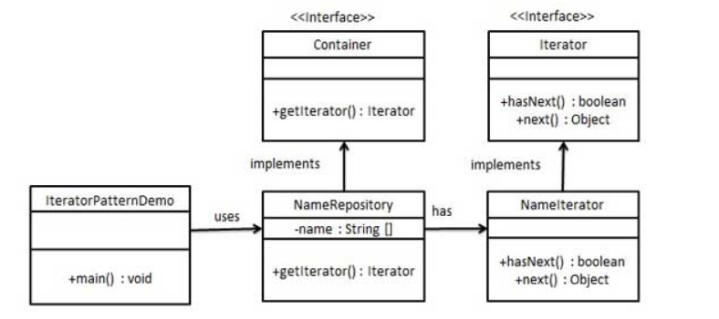

# 341. Flatten Nested List Iterator

无限制嵌套列表的迭代器。

https://leetcode.com/problems/flatten-nested-list-iterator/

# 迭代器设计模式



自底向上：

容器内部保存一个迭代器，专门用于遍历容器。

自顶向下：

- 所有容器都实现了相同的iter接口，意味着不需要关心容器内部细节，可以统一遍历容器
- 切换容器遍历方式，增加容器遍历方式都很方便

````java
public class NameRepository implements Container {
    public String[] names = {"Robert" , "John" ,"Julie" , "Lora"};
    @Override
    public Iterator getIterator() {
           return new NameIterator();
    }
    private class NameIterator implements Iterator {
   int index;
   @Override
   public boolean hasNext() {
   		if(index < names.length){
        	  return true;
   		   }
          return false;
       }
       @Override
       public Object next() {
          if(this.hasNext()){
             return names[index++];
          }
          return null;
       }     
   }
}
````

# v1

视为一个多叉树，直接遍历取出所有数据

````java
/*
视为一个多叉树，直接遍历取出所有数据
Runtime: 2 ms, faster than 98.58% of Java online submissions for Flatten Nested List Iterator.
        Memory Usage: 41.3 MB, less than 81.91% of Java online submissions for Flatten Nested List Iterator.
*/
class NestedIterator_2 implements Iterator<Integer> {

    private List<Integer> list;
    private Iterator<Integer> it;

    public void trav(List<NestedInteger> root) {
        for (NestedInteger n : root) {
            if(n.isInteger()) list.add(n.getInteger());
            else{
                trav(n.getList());
            }
        }
    }
    public NestedIterator_2(List<NestedInteger> nestedList) {
        list = new LinkedList<>();
        trav(nestedList);
        it = list.iterator();
    }

    @Override
    public Integer next() {
        return it.next();
    }

    @Override
    public boolean hasNext() {
        return it.hasNext();
    }
}
````

# v2

懒加载，比较有意思的思路，在hashNext的时候，如果发现首部节点是列表，则展开
并且，最重要的是添加到当前list的头部，这个是神来之笔
此外，为了保证addFirst的效率，另一个技巧是将原来的list直接转为LinkedList

````java
/*
Runtime: 2 ms, faster than 98.58% of Java online submissions for Flatten Nested List Iterator.
Memory Usage: 41.6 MB, less than 35.44% of Java online submissions for Flatten Nested List Iterator.*/
public class NestedIterator implements Iterator<Integer> {
    private LinkedList<NestedInteger> list;

    public NestedIterator(List<NestedInteger> nestedList) {
        list = new LinkedList<>(nestedList);
    }

    @Override
    public Integer next() {
        return list.remove(0).getInteger();
    }

    @Override
    public boolean hasNext() {
        while (list != null && !list.isEmpty() && !list.get(0).isInteger()) {
            List<NestedInteger> cur = list.remove(0).getList();
            for (int i = cur.size() - 1; i >= 0; i--) {
                list.addFirst(cur.get(i));
            }
        }
        return !list.isEmpty();
    }
}
````

# REF

- 一开始想的都太死板，iteration的实现可以很灵活，思路都来自：https://mp.weixin.qq.com/s?__biz=MzAxODQxMDM0Mw==&mid=2247485629&idx=1&sn=fc0d0fc2b8618a9b8a575cfa9d5b1c4a&chksm=9bd7f6b5aca07fa33c4fbce0dc439359592ace091814fdcdc0742f336722398090396f0b3668&scene=21#wechat_redirect